 # 🏡 HomeEase - Smart Home Services Booking System

**HomeEase** is a full-stack smart home service booking platform built with Java Spring Boot and Thymeleaf.  
It enables users to book home services like plumbing, cleaning, and electrical work, while providers manage their jobs, and admins oversee the entire platform.

---

## 🚀 Features

- 👥 Role-based login system (Admin, User, Provider)
- 📦 Add & manage home services
- 📅 Bookings with status tracking
- 💳 Razorpay payment integration (Card, UPI, COD)
- 📧 Email support via Gmail SMTP
- 🧾 Invoice download & refund tracking
- 🌐 Thymeleaf frontend (HTML, CSS, JS)
- 🔐 Secure properties with `.gitignore`

---

## 🧑‍💼 Role-Based Functionality

# 👤 User
- Register & login via form
- Reset password via email
- Contact admin via contact form
- View all available services
- Book service using Razorpay, UPI, Card, or Cash on Delivery
- Apply discount coupons during booking
- Track current bookings
- Cancel bookings if needed
- View booking history
- Rate and review services
- Download invoice for each booking
- View refund status (if applicable)
- Logout securely

# 👨‍🔧 Provider
- Register and select multiple service categories
- View bookings only for selected services
- Accept or reject user bookings
- Update the status of assigned bookings
- Notify admin upon completion or issue

# 🛠️ Admin
This project includes a predefined admin account.
🛡️ For security reasons, the admin email and password are not shared publicly.
📩 Please contact the project admin to gain access to the admin panel.

- View dashboard: total users, services, bookings, and revenue
- View booking stats by status (confirmed, pending, cancelled, refund)
- Manage users (activate, deactivate, view)
- Manage service providers
- Add, update, or delete services
- Manage and apply coupons
- View flagged users and provider status
- Export all bookings as `.csv` file

---

## 🛠️ Tech Stack

| Layer         | Technology                  |
|---------------|-----------------------------|
| Language      | Java 17                     |
| Framework     | Spring Boot                 |
| ORM           | Hibernate (JPA)             |
| Database      | MySQL                       |
| Email         | Gmail SMTP                  |
| Payment       | Razorpay Java SDK           |
| Frontend      | Thymeleaf, HTML, CSS, JS    |
| Build Tool    | Maven                       |
| IDE           | Spring Tool Suite 4 (STS)   |

---

## 📁 Project Structure

HomeEase/
├── src/
│   └── main/
│       ├── java/com/homeease/
│       │   ├── config/
│       │   ├── controller/
│       │   ├── dto/
│       │   ├── entity/
│       │   ├── exception/
│       │   ├── repository/
│       │   ├── service/
│       │   └── util/
│       └── resources/
│           ├── static/
│           │   ├── css/
│           │   ├── js/
│           │   └── images/
│           └── templates/
│               ├── admin/
│               ├── auth/
│               ├── booking/
│               ├── payment/
│               ├── provider/
│               ├── service/
│               └── user/
├── application.properties         ← 🔒 *Not Committed*
├── application-example.properties ← ✅ *Safe version*
├── data.sql
├── .gitignore
├── README.md
└── pom.xml


---

## ⚙️ Setup Instructions

### 1. Clone the Repository

```bash
git clone https://github.com/Ankit3218/HomeEase.git
cd HomeEase

cp src/main/resources/application-example.properties src/main/resources/application.properties

Update values like:
spring.datasource.username=your_mysql_username
spring.datasource.password=your_mysql_password
razorpay.keyId=your_razorpay_key
razorpay.keySecret=your_razorpay_secret
spring.mail.username=your_email@gmail.com
spring.mail.password=your_gmail_app_password

3. Run the App
mvn clean install
mvn spring-boot:run

Visit:
📍 http://localhost:8082


💳 Razorpay Setup
* Accepts: UPI, Card, Wallet, Netbanking
* Razorpay Java SDK integrated
* Requires valid Razorpay key & secret

📧 Email Configuration (Gmail SMTP)
spring.mail.host=smtp.gmail.com
spring.mail.port=587
spring.mail.username=your_email@gmail.com
spring.mail.password=your_app_password
spring.mail.properties.mail.smtp.auth=true
spring.mail.properties.mail.smtp.starttls.enable=true


 📸 Screenshots

 🛠️ Admin Screens

 📊 Dashboard  
[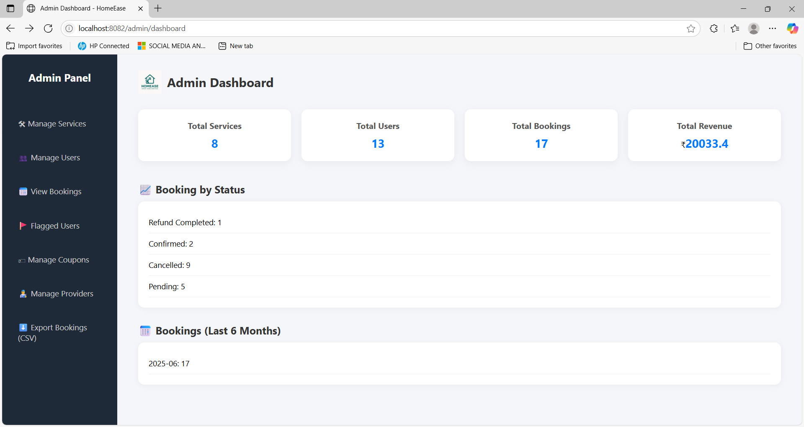](screenshots/admin-dashboard.png)

 🚩 Flagged Users  
[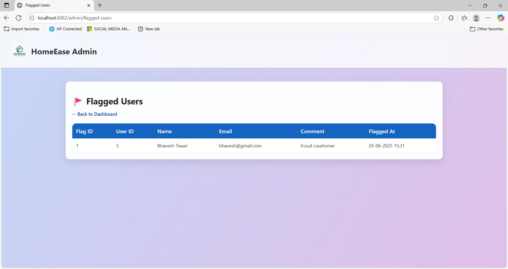](screenshots/admin-flagged-user.png)

 🎫 Manage Coupons  
[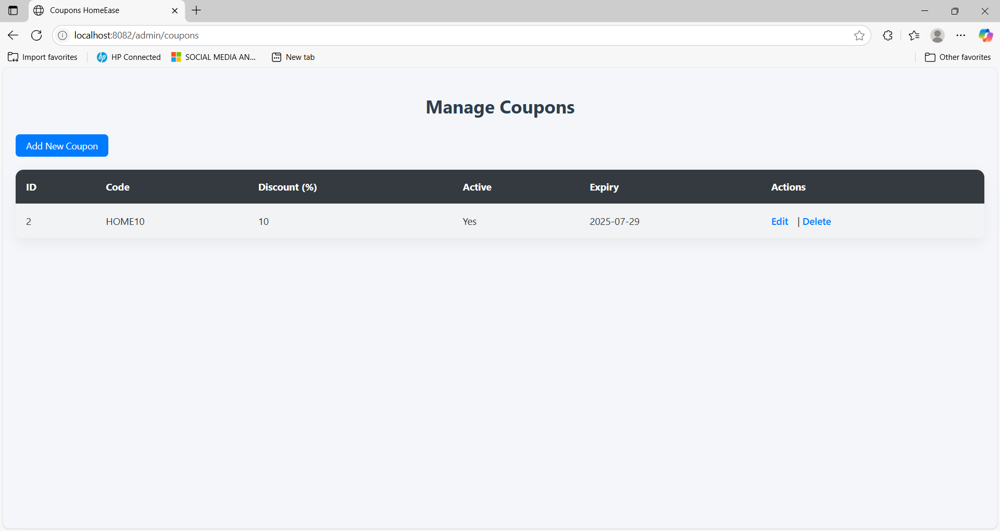](screenshots/admin-manageCoupon.png)

 🧾 Manage Services  
[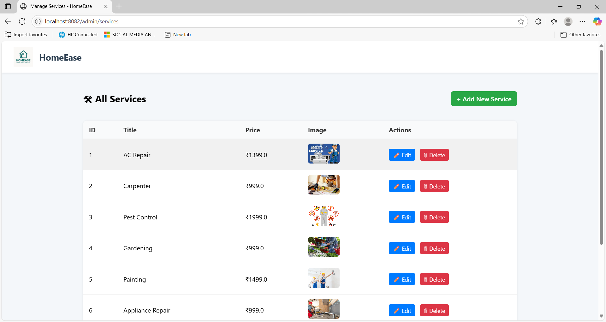](screenshots/admin-manage-service.png)

 👥 Manage Users  
[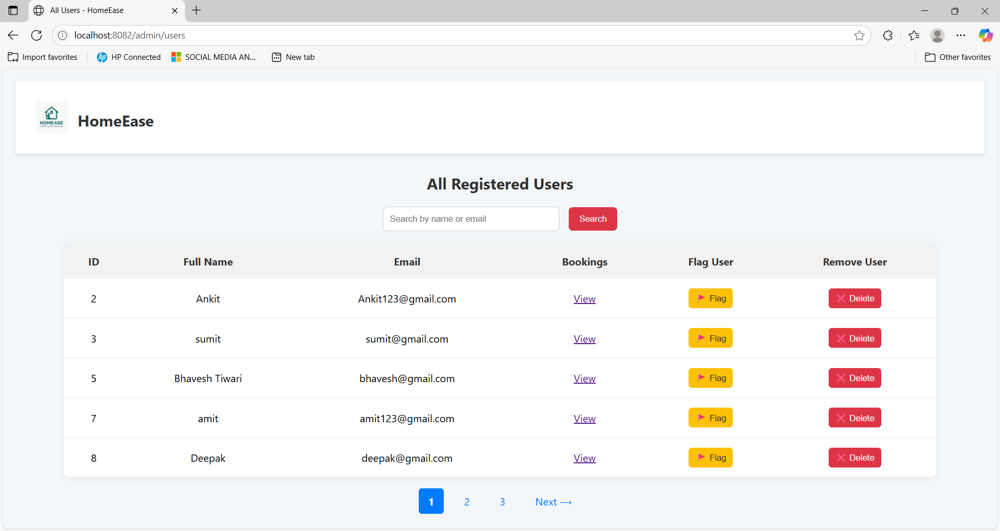](screenshots/admin-manage-user.png)

 🔧 Provider Management  
[](screenshots/admin-providerManagement.png)

 📋 View Bookings  
[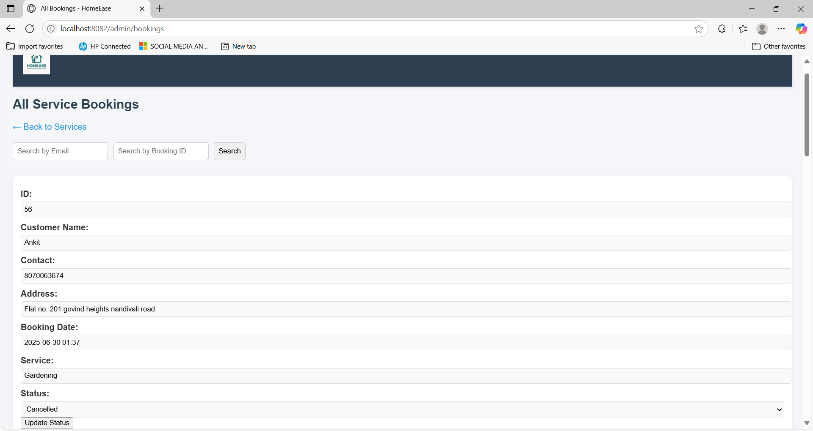](screenshots/admin-seeBookings.png)

---
 👨‍🔧 Provider Screens

 🧑‍💻 Dashboard  
[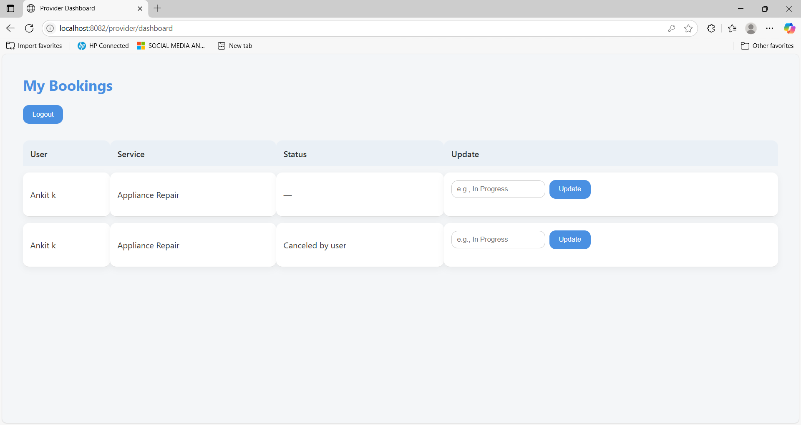](screenshots/Provider-dashboard.png)

 🔐 Login  
[](screenshots/Provider-LoginPage.png)

 📝 Registration Page 1  
[](screenshots/provider-registrationPage1.png)

 📝 Registration Page 2  
[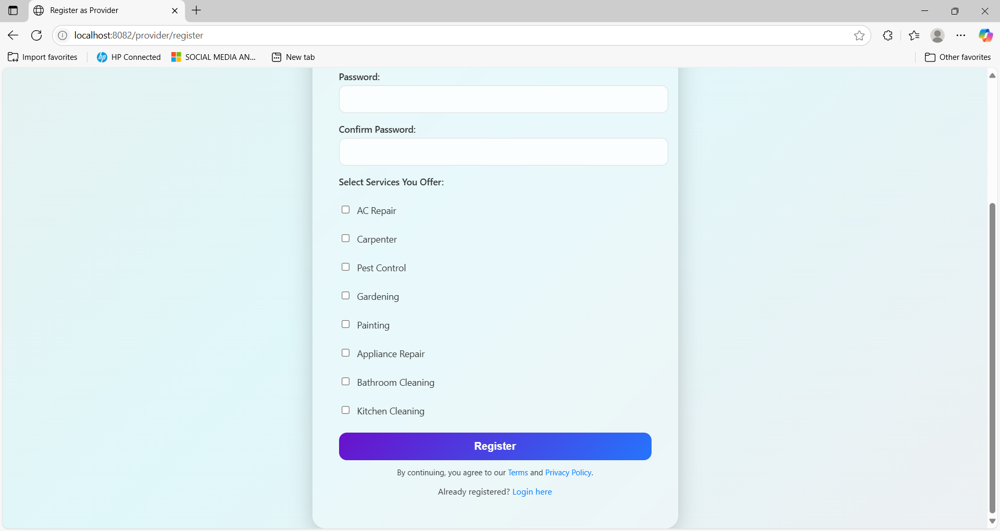](screenshots/provider-RegistrationPage2.png)

---

 👤 User Screens

 🏠 Home Page  
[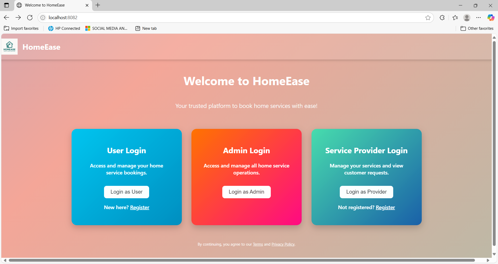](screenshots/Home-page.png)

 🔐 Login Page  
[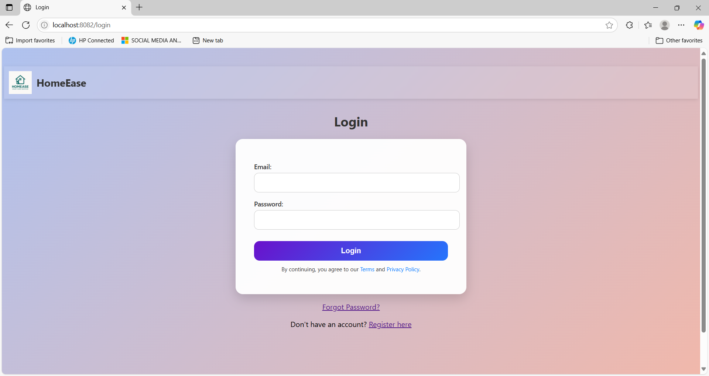](screenshots/user-loginPage.png)

 📝 Registration Page  
[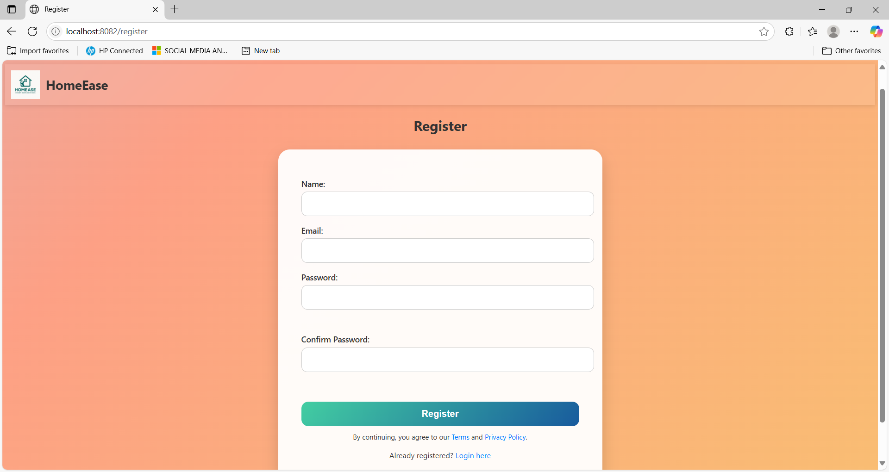](screenshots/user-registrationPage.png)

 👋 Welcome Page  
[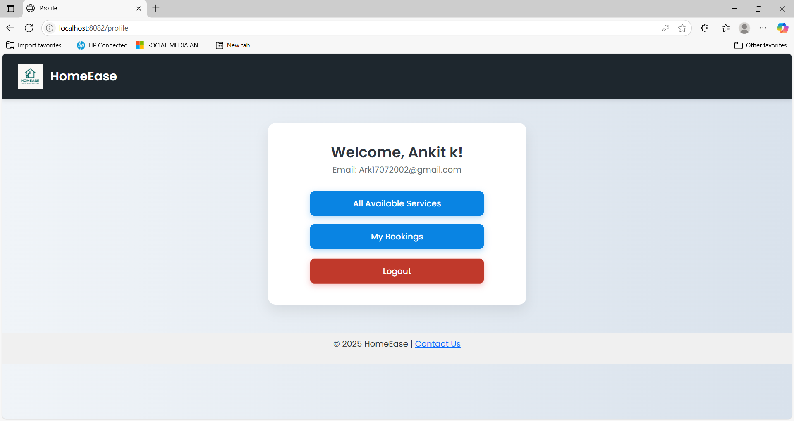](screenshots/user-welcomePage.png)

 📅 Booking Page 1  
[](screenshots/user-bookingPage1.png)

 📅 Booking Page 2  
[](screenshots/user-bookingPage2.png)

 📍 Booking Tracking  
[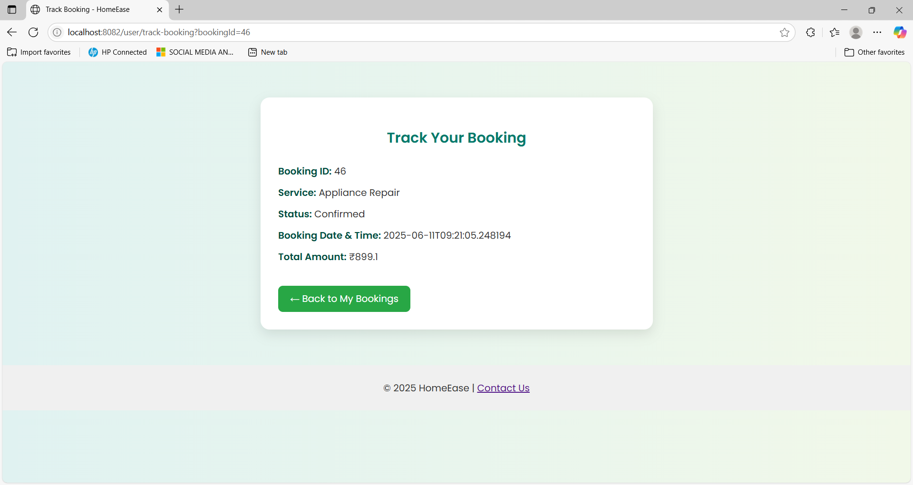](screenshots/user-bookingTrakingPage.png)

 ❌ Cancelled Booking  
[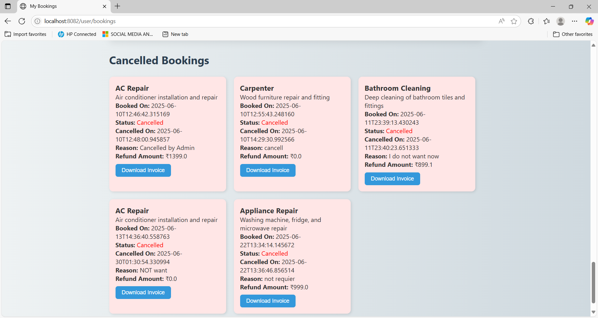](screenshots/user-cancelledBookingPage.png)

 📑 All Bookings Page  
[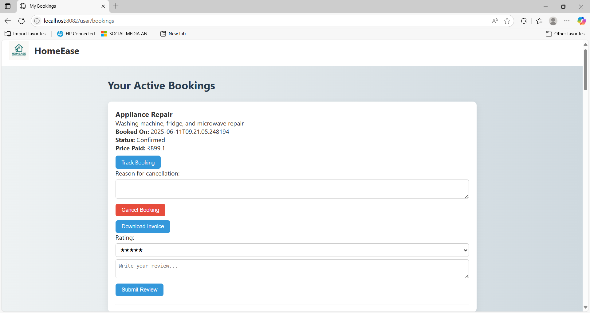](screenshots/user-allBookingPage.png)

 💬 Contact Us Page  
[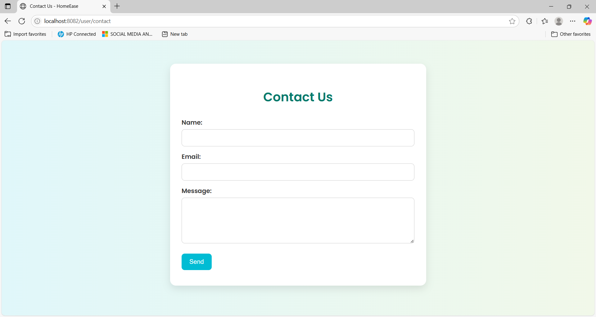](screenshots/user-contactUsPage.png)

 🛠️ Services Page  
[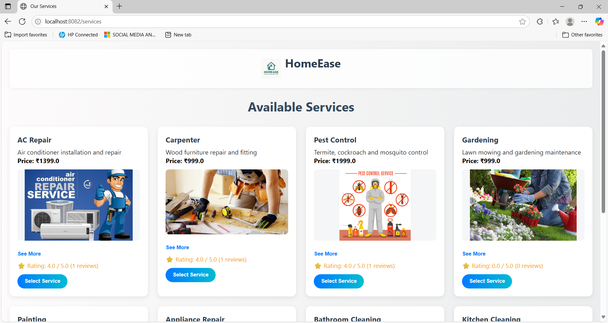](screenshots/Service-Page.png)


👨‍💻 Author
Ankit Kanojiya
Java Backend Developer | Spring Boot | Razorpay | Thymeleaf
📧 ankitrk3218@gmail.com
🔗 GitHub

📄 License
This project is licensed under the MIT License
